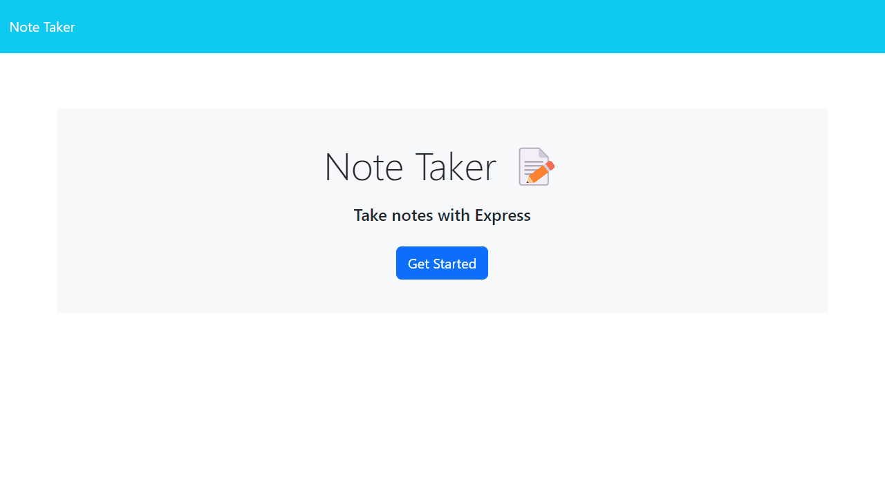

# Jot Something Down

## Description

A simple note taking application where you can title some thoughts and save them forever in the ether, unless you decide to delete them.

## Table of Contents

- [Installation](#installation)
- [Usage](#usage)
- [Sample](#sample)
- [Contributing](#contributing)
- [License](#license)

## Installation

To install this application, perform the following:

Clone the repository, change to the cloned application directory, and run "npm install."

## Usage

To use this application, enter "npm run start" in your terminal and hit the "Enter" key.

## Sample

## License

[MIT](./LICENSE) © MyComplex

## Contributing

Feel free to fork this repository and create a Pull Request.

## Questions

If you have any questions, please feel free to reach out to me via [email](mailto:jo_nez@hotmail.com) or on [Github](https://github.com/MyComplex/).
